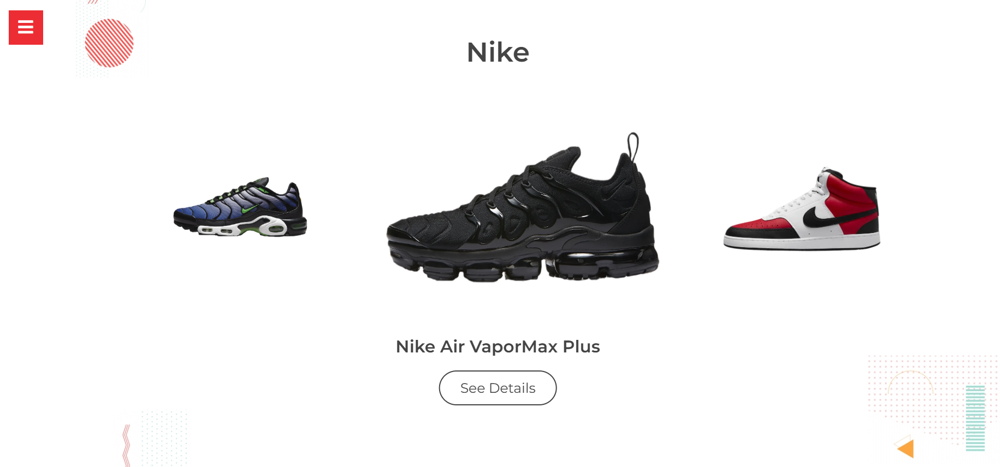
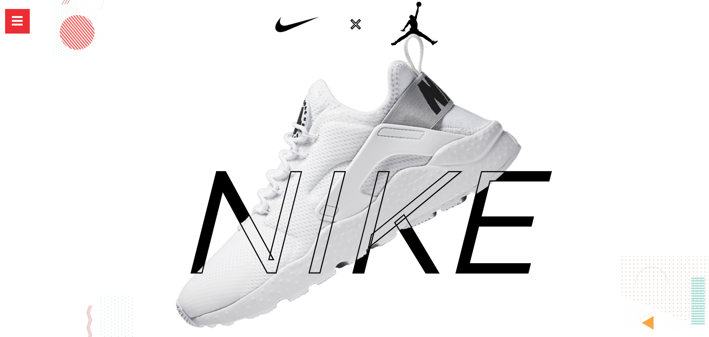
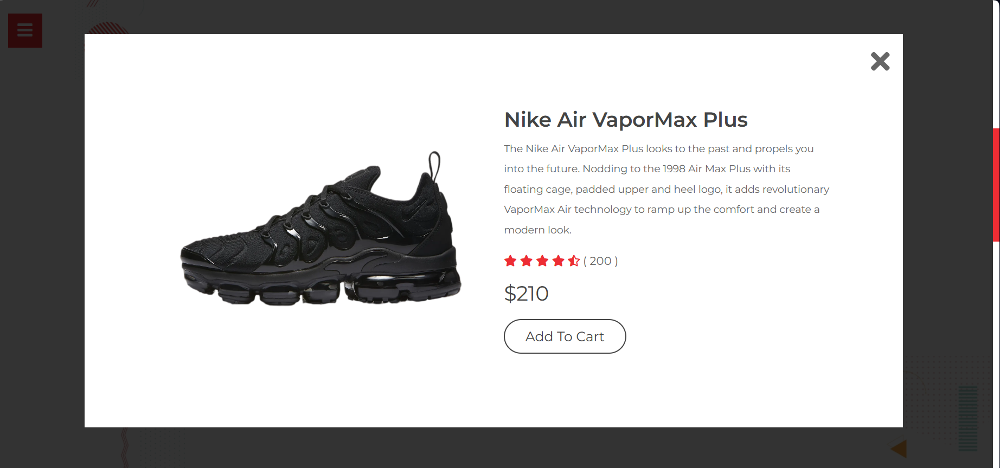
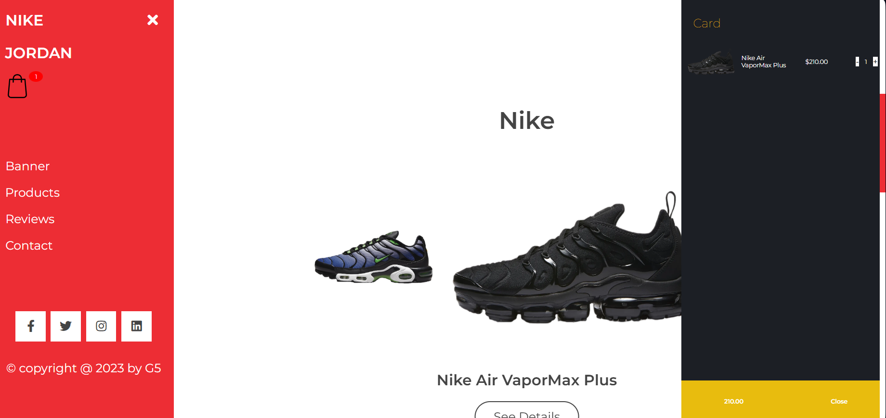

# 👟 Nike x Jordan eCommerce Shop

A fully responsive eCommerce web UI for Nike and Jordan sneakers, built with **HTML**, **CSS**, and **JavaScript**.  
This project simulates a modern shopping experience with product cards, modal details, cart view, and customer testimonials.




---

## 🚀 Features

- 🖼️ Hero banner with dynamic branding
- 🧾 Product listing for Nike and Jordan shoes
- 🛒 Product detail modals with price, description, and “Add to Cart”
- 🧺 Sidebar cart that displays selected items and total
- 💬 Customer reviews with avatar display
- 📱 Responsive design (mobile-friendly)
- 📧 Contact form at the bottom of the page

---

## 📁 Tech Stack

- **HTML5**
- **CSS3** (Flexbox, Grid, animations)
- **JavaScript** (Vanilla, DOM manipulation)

---

## 📸 Screenshots

| Section             | Preview                                          |
|---------------------|--------------------------------------------------|
| Hero Banner         |                   |
| Product Gallery     |             |
| Product Details     |      |
| Reviews & Contact   |               |
| Sidebar Cart        |                     |

---

## 🧪 How to Run

1. Clone the repo:

```bash
git clone https://github.com/E1003/sneaker-store
